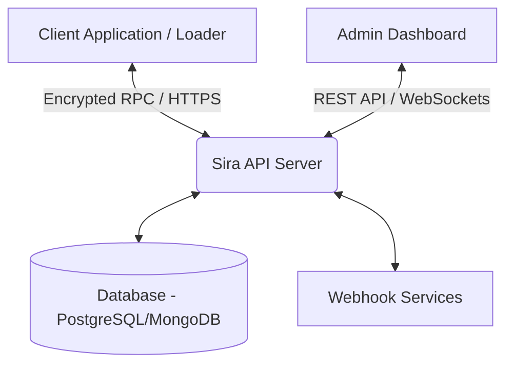

<div align="center">
  <h1>🛡️ Sira KeyAuth Architecture</h1>
  <p><strong>Advanced Cloud-Based Authentication, Licensing & Code Execution Platform</strong></p>

  <p>
    <a href="https://github.com/0Rafas/Sira-KeyAuth"></a>
    <a href="https://github.com/0Rafas/Sira-KeyAuth"></a>
    <a href="https://github.com/0Rafas/Sira-KeyAuth"></a>
  </p>
</div>

---

## 📖 Introduction

**Sira KeyAuth** is a sophisticated, high-security licensing and authentication architecture designed to transcend traditional license management tools. Built for modern software developers, it provides a comprehensive suite for application security, cloud-based code execution, anti-analysis (Anti-VM/Anti-Debug), and seamless user management. 

At its core, Sira KeyAuth shifts the paradigm from simple local license checking to a **cloud-based execution model** where sensitive application logic is processed securely on the server-side, effectively mitigating local reverse engineering attacks.

This repository contains the full architectural blueprint, the **Electron-based Administrator Dashboard**, and the skeleton for the **Server-Side API** and **Client Loaders**.

---

## ✨ Key Features

- 🖥️ **Cross-Platform Admin Dashboard**: Built with Electron, Vite, React, and Tailwind CSS. Manage applications, licenses, users, webhooks, and subscriptions in real-time.
- 🔐 **Cloud-Based Code Execution (RPC)**: Sensitive code is never shipped to the client. It is executed on the server, returning only the results to the client.
- 🛡️ **Advanced Anti-Analysis**: Server-assisted Anti-VM, Anti-Debugging, and Anti-Dump checks.
- 🎫 **Robust License Management**: Time-based, lifetime, hardware-locked (HWID), and usage-based licensing tiers.
- 🌍 **Geographic & IP Rules**: Block or allow connections based on country, IP, or application version.
- 🔔 **Webhooks & Real-Time Events**: Integrate with Discord, Telegram, or custom endpoints for real-time notifications on purchases, logins, or bans.
- 💬 **Live Chat & Event Logging**: Track user actions globally and communicate securely.

---

## 🏗️ Architecture Overview

The Sira KeyAuth ecosystem is divided into three main components:

1. **The Administrator Dashboard** (Frontend/Desktop App)
2. **The Server-Side API** (Backend System)
3. **The Client Stub / Loader** (Integration in user apps)



---

## 🛠️ How to Program the Server-Side (Backend Implementation Guide)

This repository provides the dashboard and the skeleton architecture. To make the entire ecosystem functional, you need to implement the **Server-Side**. Here is a detailed guide on how to build and connect it:

### 1. Database Schema
Your database must support the data models defined in `dashboard/src/types/index.ts`. Essential tables/collections include:
- `Users`: Admin and developer accounts.
- `Applications`: Software projects being protected.
- `Licenses`: Generated license keys, HWIDs, and expiry dates.
- `AppUsers`: End-users consuming the licenses.
- `Sessions`: Active user sessions and validation tokens.

### 2. REST API Endpoints
The dashboard expects specific API routes to function. You must expose a RESTful API (Node.js/Express, Python/FastAPI, or Go) with the following structure:
- `POST /api/auth/login` - Dashboard admin login.
- `GET /api/apps` - List all managed applications.
- `POST /api/licenses/generate` - Create new license keys.
- `GET /api/users` - Fetch app-specific users.
- `POST /api/webhooks` - Register external webhook triggers.

### 3. Cloud-Based Execution (RPC)
To prevent reverse engineering of your client apps:
1. Do not put sensitive algorithms in the client.
2. Create an endpoint `POST /api/client/execute`.
3. The client sends parameters (encrypted).
4. The server validates the session, executes the function locally, and returns the encrypted result.

### 4. Anti-Analysis & Security
- Implement **HWID Hashing**: When a client logs in, hash their Motherboard, CPU, and Disk serials. Store this in the `AppUsers` table.
- Implement **Heartbeat System**: Clients must ping the server every 60 seconds (`POST /api/client/heartbeat`). If the heartbeat drops, the server invalidates the session.
- Implement **Payload Encryption**: Use AES-256-GCM. The client and server should negotiate a session key using ECDH (Elliptic-curve Diffie–Hellman) during the initial handshake.

---

## 🚀 Setting up the Administrator Dashboard

The Dashboard is fully implemented and ready to be connected to your backend.

### Prerequisites
- [Node.js](https://nodejs.org/) (v18 or higher)
- [npm](https://npmjs.com/) or yarn

### Installation
```bash
# Clone the repository
git clone https://github.com/0Rafas/Sira-KeyAuth.git

# Navigate to the dashboard
cd Sira-KeyAuth/dashboard

# Install dependencies
npm install

# Configure Environment Variables
# Create a .env file and set your API base URL
echo "VITE_API_URL=http://localhost:3000/api" > .env
```

### Running in Development
```bash
npm run dev
```

### Building for Production
```bash
# Build for Windows
npm run dist:win

# Build for macOS
npm run dist:mac

# Build for Linux
npm run dist:linux
```

---

## 🧩 Connecting the Missing Pieces

To achieve a production-ready state, the following components must be linked:

1. **Authentication Secret**: The Dashboard uses JWT for authentication. Ensure your backend signs tokens with a secure secret and the Dashboard `VITE_API_URL` points to your backend.
2. **WebSockets for Real-Time Stats**: Implement a WebSocket server (e.g., Socket.io) to push `EventLog` and `DashboardStats` directly to the dashboard, ensuring the charts update dynamically without refreshing.
3. **Bot Integrations**: The `bots/` directory contains skeletons for Discord and Telegram. You can link these to the server to allow admins to generate licenses directly via Discord commands.
4. **Deploying the Backend**: Dockerize your backend using the provided `docker/` folder skeleton. Use `docker-compose` to spin up your API, Database, and Redis cache simultaneously.

---

## 👨‍💻 Credits & Author

This architecture, concept, and core dashboard were developed and engineered by **0Rafas**.

- **GitHub**: [0Rafas](https://github.com/0Rafas)
- **Project Role**: Lead Developer & Security Architect

If you found this project helpful, please consider leaving a ⭐ on the repository!

---
<div align="center">
  <sub>Built with ❤️ by 0Rafas. Open source under the MIT License.</sub>
</div>
